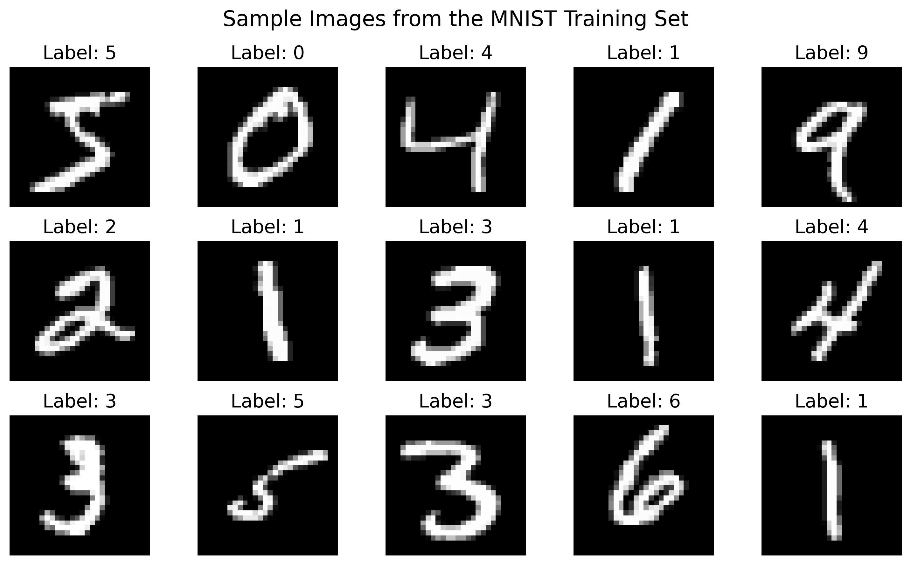
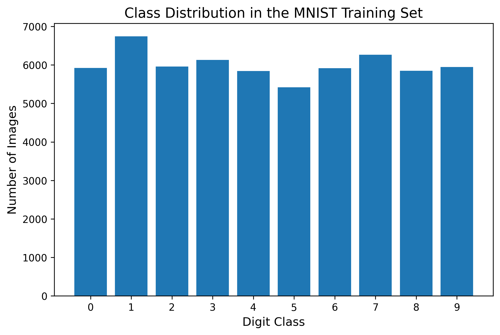
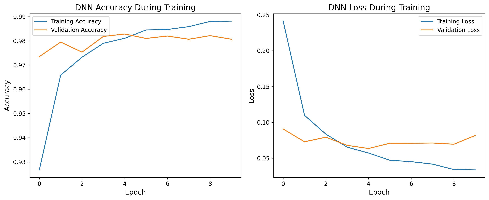
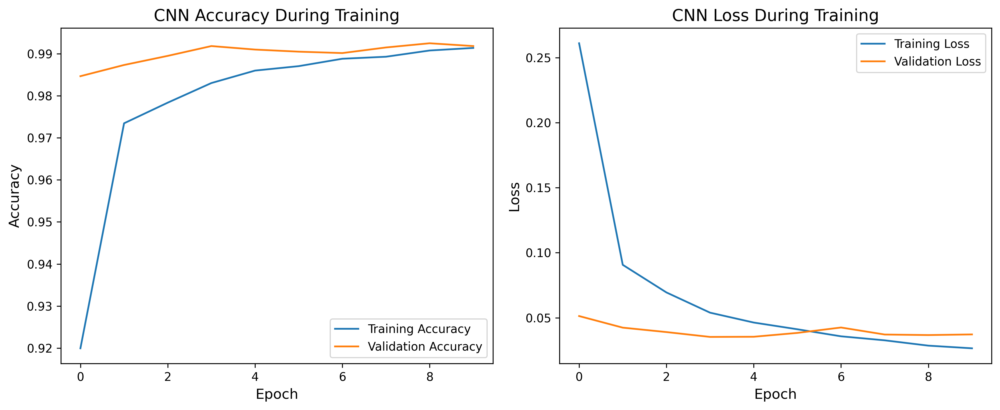
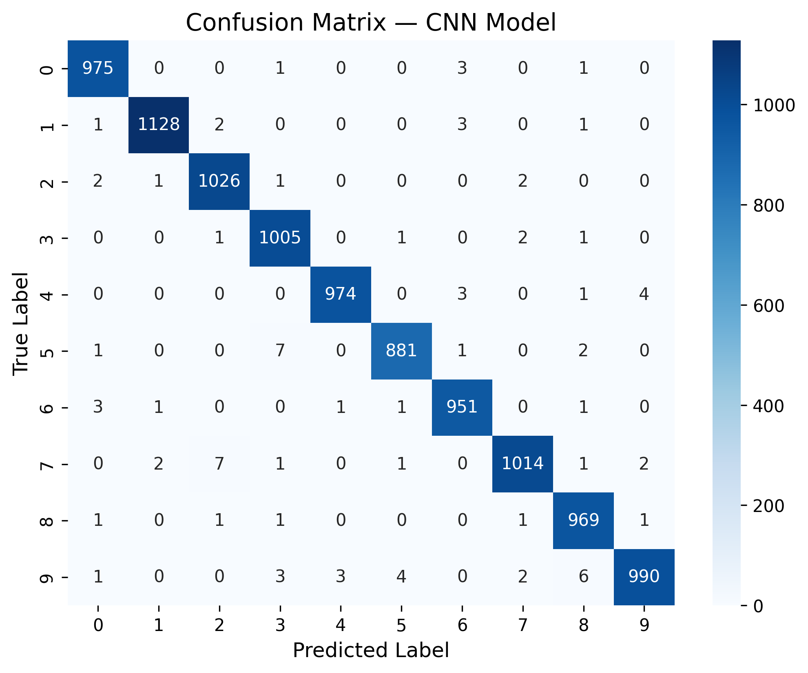
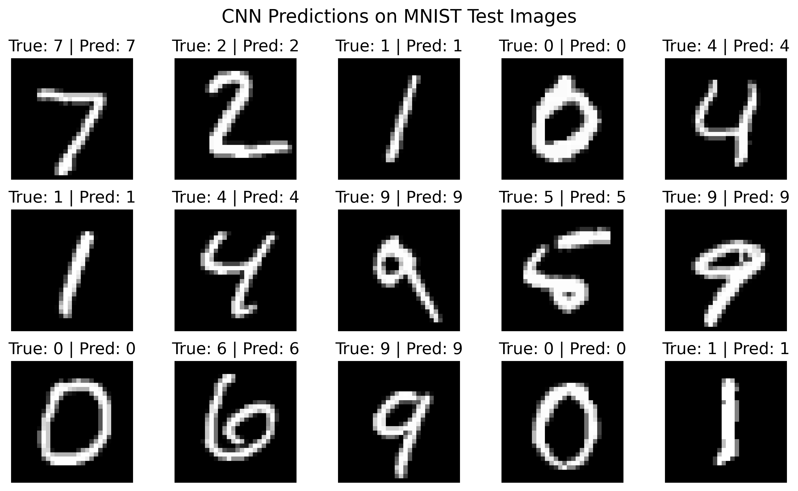

# mnist-digit-recognition-deep-learning
Deep learning project comparing Dense Neural Networks and CNNs for handwritten digit recognition on the MNIST dataset.

# Handwritten Digit Recognition with Deep Learning

### A Comparison of Dense Neural Networks and Convolutional Neural Networks on the MNIST Dataset

This project explores handwritten digit classification using deep learning techniques. The objective is to compare the performance of two neural network architectures — a **Dense Neural Network (DNN)** and a **Convolutional Neural Network (CNN)** — on the well-known **MNIST dataset**.

The results demonstrate the advantages of convolutional architectures for image recognition tasks, highlighting how spatial feature extraction significantly improves classification accuracy.

---

## Project Overview

Handwritten digit recognition is a classic problem in **computer vision** and **machine learning**. It has practical applications in areas such as:

- postal code recognition
- bank check processing
- automated document digitization
- handwriting recognition systems

In this project, we develop two deep learning models and evaluate their performance on the MNIST dataset.

The analysis focuses on understanding **how model architecture affects performance** in image classification tasks.

---

## Dataset

The **MNIST dataset** contains grayscale images of handwritten digits from **0–9**.

Key characteristics:

- **70,000 images**
- **60,000 training samples**
- **10,000 testing samples**
- Image size: **28 × 28 pixels**
- **10 digit classes**

Each image represents a handwritten digit centered within a grayscale frame.

---

## Exploratory Data Analysis

### Sample Images from the Dataset

The dataset contains handwritten digits with variations in writing style, stroke thickness, and orientation.

---

### Class Distribution

The dataset is **relatively balanced across all classes**, which ensures that the models do not become biased toward specific digits.

---

## Data Preprocessing

Before training the models, the following preprocessing steps were applied:

- **Normalization** of pixel values to the range **[0,1]**
- **Flattening images** for the Dense Neural Network
- **Reshaping images to 28×28×1** for the CNN
- **One-hot encoding** of digit labels

These transformations prepare the data for efficient training and stable optimization.

---

## Models

### Dense Neural Network (Baseline)

The baseline model is a **fully connected neural network** that treats images as flattened vectors.

Architecture:

- Dense (800 neurons)
- Batch Normalization
- Dropout
- Dense (400 neurons)
- Batch Normalization
- Dropout
- Output layer (Softmax)

While this architecture performs well, it does not preserve spatial relationships between pixels.

---

### Convolutional Neural Network

The CNN model processes images in their original spatial structure, allowing it to detect meaningful visual patterns.

Architecture:

- Conv2D (32 filters)
- Conv2D (64 filters)
- MaxPooling
- Dropout
- Flatten
- Dense (128 neurons)
- Dropout
- Output layer (Softmax)

CNNs are particularly effective for image recognition because they learn hierarchical visual features such as edges, curves, and shapes.

---

## Model Training

### Dense Neural Network Learning Curves

The Dense Neural Network converges quickly and achieves strong performance on the MNIST dataset.

---

### CNN Learning Curves

The CNN demonstrates improved learning dynamics and higher final accuracy.

---

## Model Performance Comparison

| Model | Test Accuracy | Test Loss |
|------|------|------|
| Dense Neural Network | 97.95% | 0.070 |
| Convolutional Neural Network | **99.13%** | **0.029** |

The CNN improves classification accuracy by **over 1%**, which is a significant improvement for this benchmark dataset.

---

## Confusion Matrix

Most predictions lie along the **main diagonal**, indicating correct classification of the majority of digits.

Misclassifications typically occur between visually similar digits, such as **4 and 9** or **3 and 5**.

---

## Example Predictions

The CNN accurately predicts the majority of test images, demonstrating strong generalization performance.

---

## Key Findings

- Dense Neural Networks perform well but ignore spatial structure.
- Convolutional Neural Networks capture **local visual patterns**.
- CNNs significantly improve classification performance on image data.
- The final CNN model achieves **~99.1% accuracy** on the MNIST test dataset.

---

## Technologies Used

- Python
- TensorFlow / Keras
- NumPy
- Pandas
- Matplotlib
- Seaborn
- Scikit-learn
